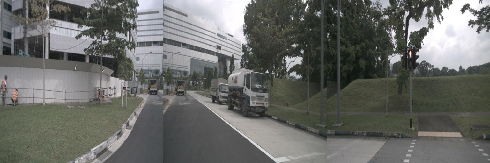
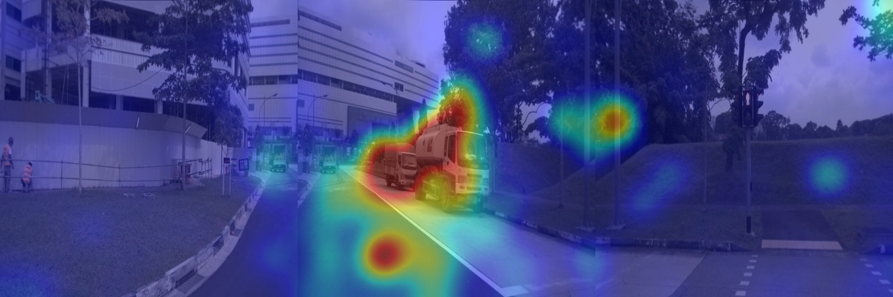
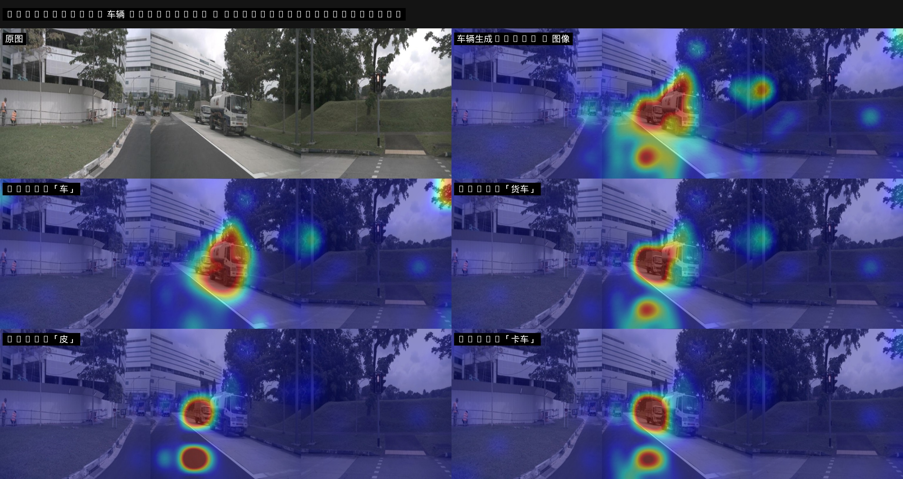
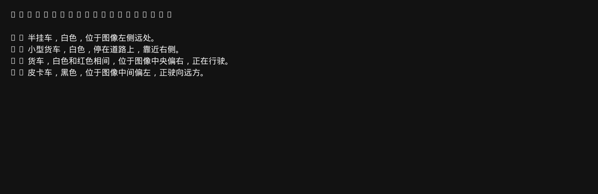

# Qwen3-VL 车辆识别与 Attention Map

用小规模视觉语言模型 **Qwen3-VL-2B-Instruct** 识别道路图中的车辆，并把语言模型在生成每个词时「看向图像哪里」画回原图。

官方没有 Qwen3-VL-0.6B（那是纯文本模型）。本仓库使用官方最小的 VL Instruct 权重 2B。

## 直观理解

可以把 VLM 想成一个人一边看路，一边写路况。每写出一个字，脑子里都会用一束手电筒扫一遍图像上的小格子。本仓库做的事，就是把这束光的落点拍下来，用热力图叠到原图上。

- 热区偏红：写这个词时，模型更在看这块图像
- 冷区偏蓝：这块图像对当前词的贡献较小

这是**相关性可视化**，不是检测框，也不能严格证明「因为看到了所以才这么说」。

## 原理

### 1. 图像如何变成 token

Qwen3-VL 不把整张图当成一张特征图直接喂给 LLM，而是：

1. 按 `patch_size=16` 切成小块，送入 ViT
2. 再按 `spatial_merge_size=2` 把相邻 2×2 的视觉特征合并成一个 **视觉 token**
3. 这些 token 插入文本序列，夹在 `<|vision_start|>` 与 `<|vision_end|>` 之间

示例图经过分辨率限制后，大约得到 **374** 个视觉 token，对应 LLM 里的空间网格 `(T, H, W) = (1, 11, 34)`。`T=1` 表示单帧图像；视频才会在时间维上大于 1。

```
原图 (W×H)
    │  patch 16×16
    ▼
ViT 特征网格  (t, h, w)     ← processor 返回的 image_grid_thw
    │  2×2 spatial merge
    ▼
LLM 视觉 token  (t, h/2, w/2)  ← 本仓库示例: 1×11×34 = 374
```

### 2. 跨模态注意力

语言模型的每一层都有因果自注意力。生成第 `q` 个词时，它会对**已经出现过的所有 token**（包括全部视觉 token）算一组权重：

```
A[q, k] = softmax_k( Q_q · K_k / √d )
```

我们关心的是：

- **query `q`**：刚生成的车辆相关 token（或全部生成 token 的平均）
- **key `k`**：`input_ids == image_token_id` 的那些位置（默认 151655，即 `<|image_pad|>`）

把这 374 维权重按 `11×34` reshape，就是一张粗网格热力图，再上采样叠回原图。

```
[ <|vision_start|>  v1 v2 ... v374  <|vision_end|>  用户问题  |  生成回答 ]
         ▲                                         │
         │              语言模型自注意力            │
         └──────── query = 生成 token ──────────────┘
                   key/value = 视觉 token
                   权重 → 11×34 → 上采样 → 叠图
```

Qwen3-VL 还有 DeepStack（把 ViT 多层特征注入 LLM）和 Interleaved-MRoPE（给视觉 token 编上高/宽/时间位置）。它们改善对齐，但**不改变** LLM 序列里视觉 token 的个数，所以画 heatmap 时仍然只按 merge 后的网格来。

### 3. 为什么必须用 eager attention

FlashAttention、SDPA、vLLM PagedAttention 为了速度通常**不保留**完整的 `softmax(QK)` 矩阵，`output_attentions=True` 会得到 `None`。本仓库因此：

- 用 HuggingFace `attn_implementation="eager"`
- **不用** vLLM 引擎做这张图（即使 conda 环境名叫 `vllm`）

代价是显存随序列长度平方增长，所以用 `--max-pixels` 限制视觉 token 数量。

## 方法

脚本 `infer_traffic_attention.py` 采用两段式，避免在 `generate()` 的每一步都存注意力。

```
① 预处理
   图像 + 车辆 prompt → chat template → pixel_values, input_ids, image_grid_thw

② 生成（不取 attention）
   model.generate(...) → 车辆列表文本

③ 教师强制前向（取 attention）
   把「prompt + 生成 token」整段再 forward 一次
   output_attentions=True → 每层 (batch, heads, q_len, k_len)

④ 抽跨模态权重
   最后 8 层、所有 head 平均
   query = 全部生成 token，或单个关键词 token（车 / 罐车 / 卡车 …）
   key   = 视觉 token 下标

⑤ 画图
   reshape → 百分位归一化 → 高斯模糊 → JET colormap → 与原图 alpha 混合
```

对应代码路径：

| 步骤 | 函数 |
|------|------|
| 组 batch | `build_inputs()` |
| 生成回答 | `generate_text()` |
| 整段前向取注意力 | `collect_attentions()` |
| 定位视觉 token | `vision_token_index()` |
| query→图像权重 | `mean_query_to_vision()` |
| 网格还原 | `llm_grid()` + `reshape_heatmap()` |
| 叠图 | `overlay_heatmap()` |

默认平均**最后 8 层**：浅层更偏纹理，后几层更偏语义（「罐车」「卡车」这类词）。关键词 token 的图往往比「全部生成 token 平均」更尖、更好解释。

## 环境与运行

conda 环境 `vllm` 已升级为 **PyTorch 2.11.0+cu128**，包含 RTX 5060 Ti 所需的 `sm_120`。Qwen3-VL 需要 `transformers>=4.57`，该版本放在本地 `.deps/`，不覆盖环境里给旧 vLLM 预留的 transformers。

```bash
conda activate vllm
python infer_traffic_attention.py \
  --image assets/traffic_tanker_light.jpg \
  --out-dir outputs
```

常用参数：

| 参数 | 含义 | 默认 |
|------|------|------|
| `--image` | 输入图 | `assets/traffic_tanker_light.jpg` |
| `--prompt` | 识别指令 | 只列看得见的车辆 |
| `--last-layers` | 平均最后 N 层注意力 | 8 |
| `--max-pixels` | 限制视觉 token，控制显存 | `512*28*28` |
| `--alpha` | 热力图混合比例 | 0.45 |

输出（`outputs/`）：

- `*_attention_overlay.jpg`：原图 + 全部生成 token 的平均注意力
- `*_attention_panel.jpg`：原图 / 整体图 / 关键词 token 对照
- `attn_token_*.jpg`：单个词（如「车」「卡车」）的注意力
- `*_result.json`：识别文本与网格信息
- `*_heatmap.npy`：未上采样的 `H×W` 权重

## 示例结果

输入为 `assets/traffic_tanker_light.jpg`（道路前视，含罐车 / 货车等）。

**输入图**

<p align="center">
    
</p>

**识别结果**

```
1. 半挂车，白色，位于图像左侧远处。
2. 小型货车，白色，停在道路上，靠近右侧。
3. 货车，白色和红色相间，位于图像中央偏右，正在行驶。
4. 皮卡车，黑色，位于图像中间偏左，正驶向远方。
```

**整体 attention overlay**（全部生成 token 平均，最后 8 层）

<p align="center">
    
</p>

**对照面板**（原图 / 整体热力图 / 关键词 token）

<p align="center">
    
</p>

**回答文本**

<p align="center">
    
</p>

## 目录

```
attention_map/
├── infer_traffic_attention.py   # 推理 + 可视化
├── assets/                      # 示例道路图
├── models/Qwen3-VL-2B-Instruct  # 本地权重（需自行下载）
├── .deps/                       # transformers 4.57.1 等（不进 git）
└── outputs/                     # 运行结果
```

权重可用 ModelScope 下载：

```bash
modelscope download --model Qwen/Qwen3-VL-2B-Instruct \
  --local_dir models/Qwen3-VL-2B-Instruct
```

## 常见误区

1. **格子数不是原图像素数。** 必须用 `image_grid_thw / spatial_merge_size` 还原，否则 heatmap 会对不齐。
2. **亮 ≠ 检测成功。** 注意力是生成该词时的相关区域；2B 模型仍可能把罐车说成货车，但热区仍落在车上。
3. **vLLM / FlashAttention 画不出这张图。** 它们不返回完整注意力矩阵。
4. **旧版 `vllm==0.8.1` 引擎与当前 torch 2.11 二进制不兼容。** 本任务走 HuggingFace eager，不调用 `import vllm`。若要重新启用 `vllm serve`，需要安装与 torch 2.11 匹配的 vLLM（约 0.26+）。

## 参考

- Qwen2-VL: [arXiv:2409.12191](https://arxiv.org/abs/2409.12191)（动态分辨率、M-RoPE、spatial merge）
- Qwen2.5-VL: [arXiv:2502.13923](https://arxiv.org/abs/2502.13923)
- Qwen3 Technical Report: [arXiv:2505.09388](https://arxiv.org/abs/2505.09388)
- HuggingFace `Qwen3VLForConditionalGeneration`：`output_attentions` 返回文本层 `[batch, heads, seq, seq]`
